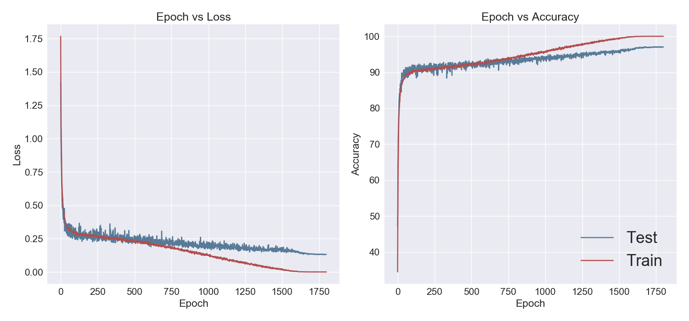

# Shake-Shake regularization
PyTorch implementation of shake-shake regularization.
Author implementations is [here](https://github.com/xgastaldi/shake-shake).

## Dependencies
- python 3.5
- PyTorch 1.0.0

## Accuracy

### CIFAR-10
|Model|Method|This implementaion |Paper|
|:---:|:---:|:---:|:---:|
|ResNet26-2x32|S-S-I|96.37|96.45|
|ResNet26-2x64|S-S-I|97.07|97.02|



### CIFAR-100
|Model|Method|This implementaion |Paper|
|:---:|:---:|:---:|:---:|
|ResNeXt29-2x4x64d|S-S-I|TODO|84.03|

## Train ResNet26-2x64d for CIFAR-10
```
python train.py --label 10 --depth 26 --w_base 64 --lr 0.1 --epochs 1800 --batch_size 64
```

## Effects of learning epoch on accuracy
|Model|Method|Epoch|This implementaion |Paper|
|:---:|:---:|:---:|:---:|:---:|
|ResNet26-2x64|S-S-I|300|96.46|-|
|ResNet26-2x64|S-S-I|600|96.65|-|
|ResNet26-2x64|S-S-I|900|96.78|-|
|ResNet26-2x64|S-S-I|1200|96.68|-|
|ResNet26-2x64|S-S-I|1500|96.77|-|
|ResNet26-2x64|S-S-I|1800|97.07|97.02|

## References
Gastaldi, Xavier. "Shake-Shake regularization."
[arXiv:1705.07485v2](https://arxiv.org/abs/1705.07485)

Gastaldi, Xavier. "Shake-Shake regularization of 3-branch residual networks."
[ICLR2017 Workshop](https://openreview.net/forum?id=HkO-PCmYl)
